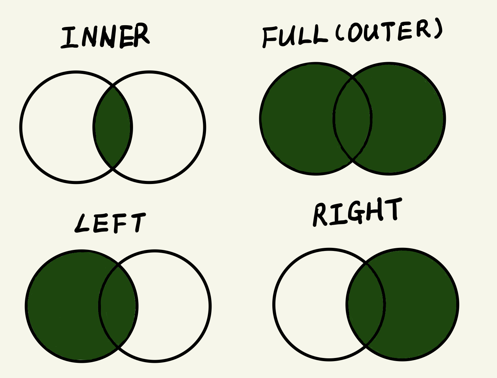

```{r setup, include=FALSE}
options(htmltools.dir.version = FALSE)
knitr::opts_chunk$set(
  fig.width=9, fig.height=3.5, fig.retina=3,
  out.width = "100%",
  cache = FALSE,
  echo = TRUE,
  message = FALSE, 
  warning = FALSE,
  hiline = TRUE
)
```


```{r xaringan-themer, include=FALSE, warning=FALSE}
library(xaringanthemer)
style_duo_accent(
  primary_color = "#5E8E3E",
  secondary_color = "#95BF47",
  inverse_header_color = "#FFFFFF"
)
```

# [Course Website](https://course2022.scientistcafe.com/) and [Github](https://github.com/happyrabbit/course2022) 


<center>
<font size = "10">
https://course2022.scientistcafe.com/
</font>
</center>

---
# Why?

<p style="font-size:38px;">Because…</p>    

--

- <p style="font-size:28px;">We need data to do the magic</p>   

--

- <p style="font-size:28px;">There are a lot of data and getting data is not always easy</p>  

--

- <p style="font-size:28px;">We spend significant amount of time querying data</p> 

--

<p style="color:blue;font-size:28px;">Start from the building concepts: data warehouse, data pipeline and data modeling</p>

---

# What is a data warehouse?

> From [Wikipedia](http://en.wikipedia.org/wiki/Database): A database is an organized collection of data.

--

.pull-left[
- It is a database

- Data collected from different sources (internal and external)

- Support further data pipeline, analytics or report
]

.pull-right[

]

---
# Why data warehouse?

.left-column[
- **Persist data**
- **Data quality**
- **Central view**
- **Model for different data usages**
- **Query performance**
- **Augment source**
]

.right-column[

]

---

# What is a data pipeline?

> [Definition](https://www.webfx.com/blog/marketing/what-is-a-data-pipeline/): A data pipeline automatically moves data from one or more sources to a target destination.

<center></center>

---

# Data model: data lake to data mart

<center></center>

---

# Building blocks for relational model

.left-column[
1. **Entities**: business concepts (sales, product, location, customer etc.) 
2. **Attributes**: characteristics of an entity
3. **Relationships**: associations among different entities, can be one-to-many, many-to-many and one-to-one.
]

.right-column[

]


```{r, echo=FALSE}
# create data
Year <- rep(2022, 6)
Month <- rep("May", 6)
Day <- c(1, 2, 3, 4, 5, 6)
PK_Date_ID <- c(151, 152, 153, 154, 155, 156)
# FK_Date_ID <- c("2022-05-01", "2022-05-01", "2022-05-01", "2022-05-02", "2022-05-05", "2022-05-06")
dim_date <- data.frame(PK_Date_ID, Year, Month, Day)


PK_Customer_ID <- sort(c(98752, 29573, 10947, 37257, 95726, 34729))
First_Name <- c("Ayden", "Lillian", "Calvin", "Allie", "Sammy", "Alice")
Last_Name <- c("Dennis", "Hoffman", "Quinn", "West", "Carson", "Chen")
Email <- paste0(tolower(First_Name), "@myemail.com")
Birthday <- c("Oct 1", "May 22", "Jun 2", "Nov 12", "Jun 22", "Jul 8")
dim_customer <- data.frame(PK_Customer_ID, First_Name, Last_Name, Email, Birthday)

FK_Date_ID <- c(151, 151, 151, 152, 155, 156)
FK_Location_ID <- c(25, 25, 30, 36, 48, 20)
FK_Product_ID <- c(88, 76, 75, 88, 88, 88)
FK_Customer_ID <- c(98752, 29573, 10947, 37257, 95726, 34729)
Quantity <- c(1,2, 1, 1, 3, 2)
Amount <- Quantity*29
fact_sales <- data.frame(FK_Date_ID, FK_Location_ID, FK_Product_ID, FK_Customer_ID, Quantity, Amount)
```

---

# Fact table

- Table containing measurements
- All records have the same granularity defined by the business
- Usually additive with timestamps but not always
- Resolve one-to-many or many-to-many relationship

```{r, echo=FALSE}
knitr::kable(head(fact_sales), format = 'html')
```

---

# Dimension table

- Table containing business elements
- Fields contain element descriptions
- Referenced by multiple fact tables

```{r, echo=FALSE}
knitr::kable(head(dim_customer), format = 'html')
```

---

# SQL 

> SQL (Structured Query Language) is a standard computer language for relational database management and data manipulation. 

- **Query**, insert, update, modify (We only look at the first one)

--

## The SQL world can be overwhelming, but it follows the 20/80 rule...
### We will cover the most used 20%

---

# The most used 20%

.pull-left[

- Basic: retrieve, filter, sort, aggregate, group

- Intermediate: subquery, temporary table, join


]

--
.pull-right[
- Advanced: window function, data types/format, string and date, pivoting data


]

---

# Basic: retrieve and filter

.pull-left[

**Retrieve**: `SELECT`, `FROM`
- Select `First_Name` and `Last_Name` from table `dim_customer`

```sql
SELECT First_Name, Last_Name 
FROM
dim_customer
```

**Filter**: `WHERE`, `LIMIT`

- Select the first 10 sales records with `Amount > 50` and only show the first 10 records

```sql
SELECT * -- select all columns
FROM fact_sales
WHERE Amount > 50
LIMIT 10
```
]

.pull-right[

]
---

# Basic: sort, aggregate and group

.pull-left[

**Sort**: `ORDER BY`, `DESC`

- Select the top 10 sales records with `Amount > 50`, ordered by `Amount` from high to low

```sql
SELECT *
FROM fact_sales
WHERE Amount > 50
ORDER BY Amount DESC
LIMIT 10
```

**Aggregate** and **group**

- Average `Amount` each customer buy (Other aggregate functions: `MAX`, `MIN` , `SUM`, `COUNT`)

```sql
SELECT FK_Customer_ID, AVG(Amount) as Avg_Amount -- name variable
FROM fact_sales
GROUP BY FK_Customer_ID
```
]

.pull-right[

]

---

# Basic SQL recap

- `SELECT`, `FROM`, `AS`
- `WHERE`, `LIMIT`
- `ORDER BY`, `DESC`
- `GROUP BY`
- `MAX`
- `MIN`
- `AVG`
- `SUM`
- `COUNT`
- `COUNT DISTINCT`

---

# Intermediate: subquery

.pull-left[
- **What is it?** query in query

- **When do we need it?** get information from multiple sources

Example: select name and email of customers who have had an order with `Amount > 50`. The `Amount` information is in table `fact_sales` and the customer information is in table `dim_customer`

```SQL
SELECT PK_Customer_ID, First_Name, Last_Name, Email
FROM dim_customer
WHERE PK_Customer_ID IN (
		SELECT customerID
		FROM fact_sales
		WHERE Amount > 50
		);
```
]

.pull-right[

]


---

# Subquery: best practice and considerations


- There is no limit to the number of subqueries you can have

- Performance slows when you nest too deeply

- Readability deteriorates when you add more
    - This website can [pre-format your SQL code](https://poorsql.com/)
    - An alternative is to use **temporary table** 
    
- Subqueries can be used in several places within a query
    - We saw an example in `WHERE`. We will see another example in `FROM` 

---
# Subquery: **temporary table** as an alternative

**Example**: calculate average amount of purchase per customer

```sql
-- use sub-query
SELECT total_amount/COUNT(FK_Customer_ID) AS average_per_customer
  FROM (
        SELECT FK_Customer_ID,
               SUM(Amount) AS total_amount,
          FROM fact_sales
          GROUP BY 1
       )
```

```sql
-- use temporary table
WITH temp_table
AS (
	SELECT FK_Customer_ID, SUM(Amount) AS total_amount,
	FROM fact_sales
	GROUP BY 1
	)
SELECT total_amount / COUNT(FK_Customer_ID) AS average_per_customer
FROM temp_table
```

---
# Intermediate: join (real power of SQL!)


.pull-left[

**Data retrieval from multiple tables in one query**

**Different types of joins**
- `INNER JOIN` selects records that have matching values in both tables
- `LEFT JOIN` returns all rows from the left table, even if there are no matches in the right table 
- `RIGHT JOIN` returns all rows from the right table
- `FULL JOIN` returns rows in either table
]

.pull-right[

]

---
# Join example

.pull-left[
Example: Find the email of those customers who had an order with `Amount > 50` 

```sql
SELECT cus.Email, sale.Amount
FROM dim_customer AS cus
INNER JOIN fact_sales AS sale 
  ON cus.PK_Customer_ID = sale.FK_Customer_ID
WHERE sale.Amount > 50
```

> We use **aliases** in this query. It is often used when performing joins to make like easier.

]

.pull-right[

]

---
# Join example

.pull-left[

```sql
SELECT cus.Email, sale.Amount
FROM dim_customer AS cus
INNER JOIN fact_sales AS sale 
  ON cus.PK_Customer_ID = sale.FK_Customer_ID
WHERE sale.Amount > 50
```

Instead of using `WHERE`, you can also filter in the `ON` clause:

```sql
SELECT cus.Email, sale.Amount
FROM dim_customer AS cus
INNER JOIN fact_sales AS sale 
      ON cus.PK_Customer_ID = sale.FK_Customer_ID
      AND sale.Amount > 50
```

> **Question: How can you use subquery to do the same?**

]

.pull-right[

]

---
# Intermediate SQL recap

- `INNER JOIN`

---
# Advanced: window function

This [PostgreSQL documentation](https://www.postgresql.org/docs/9.1/tutorial-window.html) provides an excellent description of window functions:
> A _window function_ performs **a calculation across a set of table rows** that are somehow related to the current row. This is comparable to the type of calculation that can be done with an aggregate function. But unlike regular aggregate functions, use of a window function **does not** cause rows to become **grouped into a single output row** — the rows retain their separate identities. Behind the scenes, the window function is able to access more than just the current row of the query result.

```sql
SELECT depname, empno, salary, avg(salary) OVER (PARTITION BY depname) FROM empsalary;
```
```html
  depname  | empno | salary |          avg          
-----------+-------+--------+-----------------------
 develop   |    11 |   5200 | 5020.0000000000000000
 develop   |     7 |   4200 | 5020.0000000000000000
 develop   |     9 |   4500 | 5020.0000000000000000
 develop   |     8 |   6000 | 5020.0000000000000000
 develop   |    10 |   5200 | 5020.0000000000000000
 personnel |     5 |   3500 | 3700.0000000000000000
 personnel |     2 |   3900 | 3700.0000000000000000
...
```
---

# Window function example

Common functions: `CASE WHEN`, `ROW_NUMBER()`, `RANK()`, `DENSE_RANK()`, `LAG()`, `LEAD()`

```sql
SELECT FK_Product_ID,
	Amount,
	RANK(Amount) OVER (PARTITION BY FK_Product_ID) AS rank_amount,
	DENSE_RANK(Amount) OVER (PARTITION BY FK_Product_ID) AS dense_rank_amount
ORDER BY 1, 2
```

```html
  FK_Product_ID Amount rank_amount dense_rank_amount
             75     56           1                 1
             76    112           1                 2
             88     56           1                 1
             88     56           1                 1
             88    112           3                 2
             88    168           4                 3
```
---
# Data types

Three main data types: **string**, **numeric**, and **date/time**

| Data type 	| Stored as (example) 	| Description                                                                                	|
|-----------	|---------------------	|--------------------------------------------------------------------------------------------	|
| String    	| VARCHAR(1024)       	| Any characters, with a maximum field length of 1024 characters.                            	|
| Date/Time 	| TIMESTAMP           	| Stores year, month, day, hour, minute and second values as `YYYY-MM-DD hh:mm:ss`.          	|
| Date/Time 	| DATE                	| A date. Format: `YYYY-MM-DD`. The supported range is from '`1000-01-01`' to '`9999-12-31`' 	|
| Numeric   	| DOUBLE PRECISION    	| Numerical, with up to 17 significant digits decimal precision.                             	|
| Numeric   	| INT                 	| Allows whole numbers between `-2,147,483,648` and `2,147,483,647`                          	|

> Convert between data types:  `CAST(column_name AS integer)` or `column_name::integer`

---
# When do you need to convert the data type?

- Building pipeline: move data from one database to another

- User id in one table is `STRING`, but is `INT` in the other. And you need to join the two

- Numbers as `STRING` and you need to calculate the `SUM`

- `DATE` v.s `STRING` 

- Calculate percentage of two `INT` (often count)
    - `# in each country / # total customers` may give you 0
    - Trick: `# in each country * 1.0 / # total customers`

---
# Advanced: others

- [Date](https://mode.com/sql-tutorial/sql-datetime-format/)

- [String](https://mode.com/sql-tutorial/sql-string-functions-for-cleaning/)

- [Pivoting data](https://mode.com/sql-tutorial/sql-pivot-table/) 

- Where can I practice SQL? [Leetcode](https://leetcode.com)

---
class: inverse center middle

# Questions?

