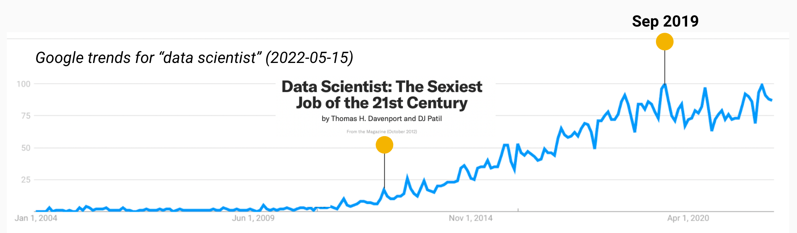
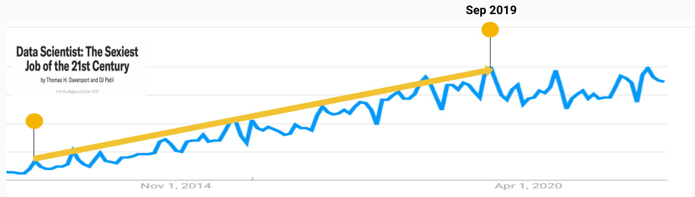
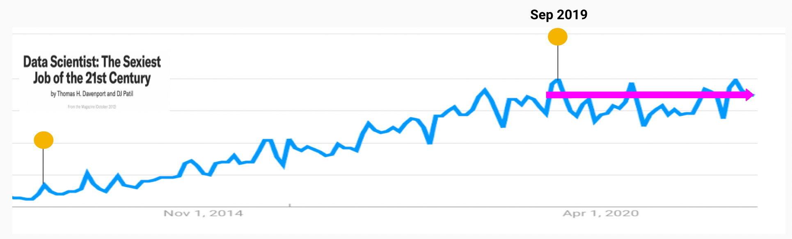
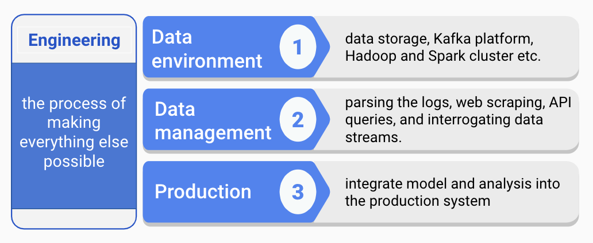
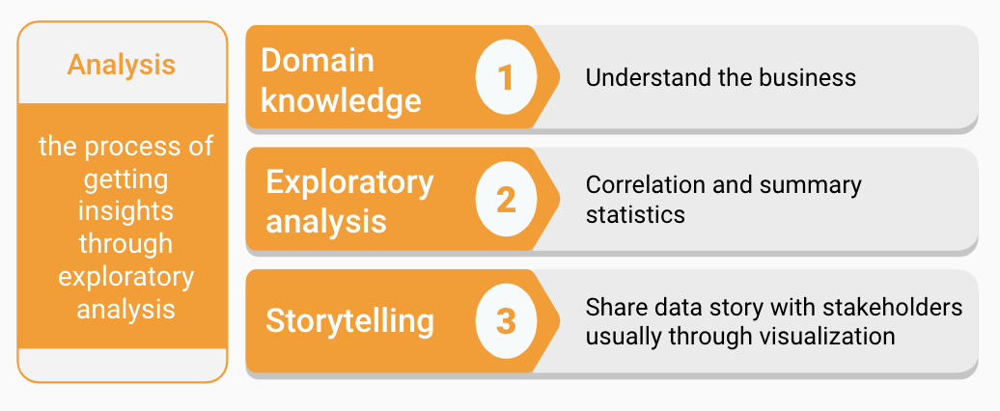
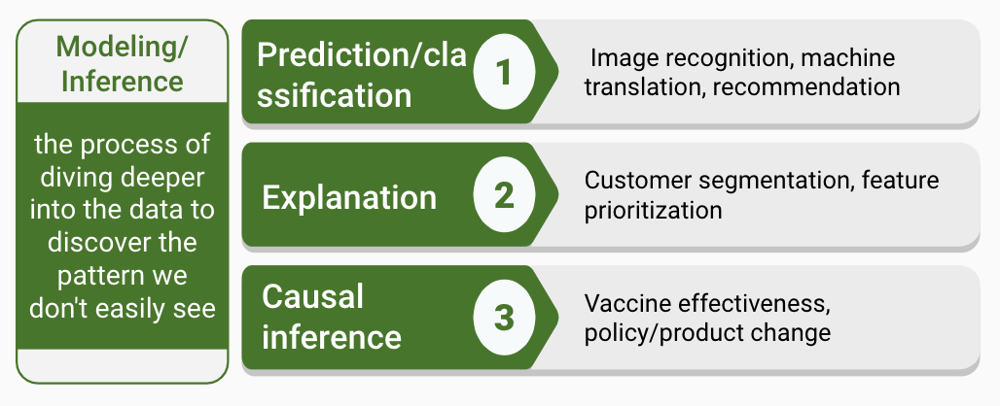
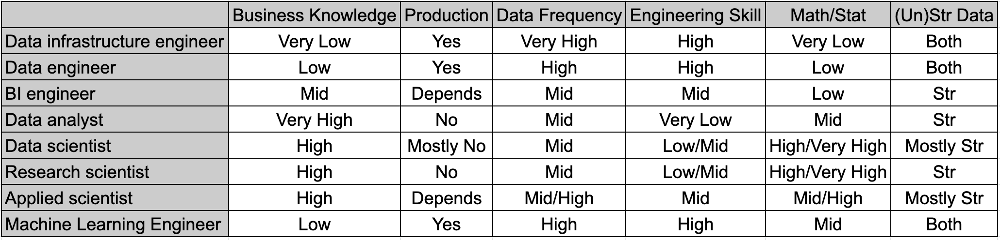
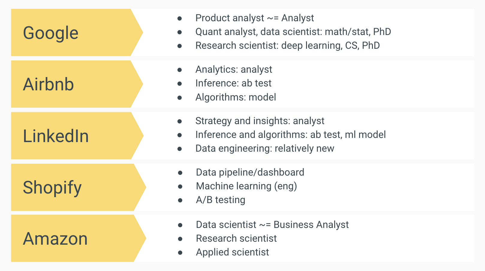
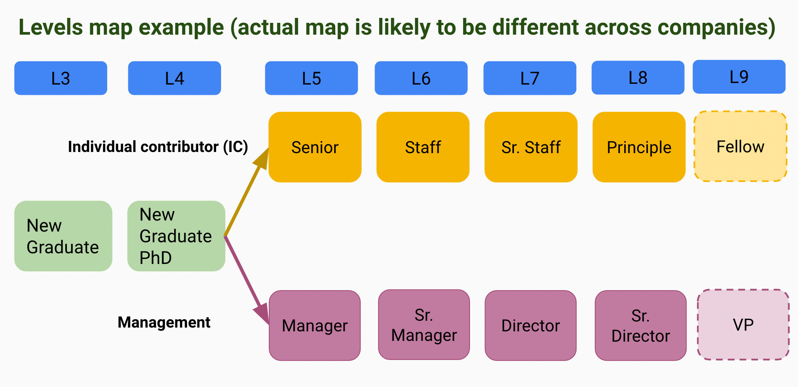
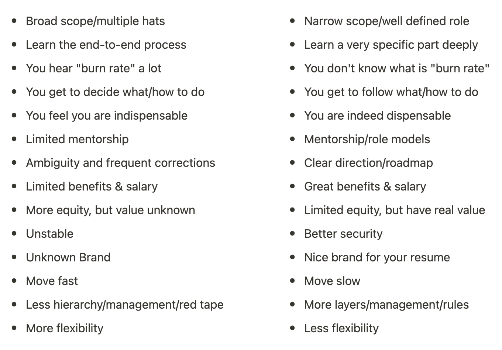

```{r setup, include=FALSE}
options(htmltools.dir.version = FALSE)
knitr::opts_chunk$set(
  fig.width=9, fig.height=3.5, fig.retina=3,
  out.width = "100%",
  cache = FALSE,
  echo = TRUE,
  message = FALSE, 
  warning = FALSE,
  hiline = TRUE
)
```


```{r xaringan-themer, include=FALSE, warning=FALSE}
library(xaringanthemer)
style_duo_accent(
  primary_color = "#5E8E3E",
  secondary_color = "#95BF47",
  inverse_header_color = "#FFFFFF"
)
```

# [Course Website](https://course2022.scientistcafe.com/) and [Github](https://github.com/happyrabbit/course2022) 


<center>
<font size = "10">
https://course2022.scientistcafe.com/
</font>
</center>

---
class: inverse center middle

# What is data science?
## A question with ever changing answers

---


# 2012: Let the wild rumpus begin!



---

# 2012-2019: golden age of data science


---

# 2012-2019: golden age of data science

- 2013: [Universities offer courses in a hot new field data science](https://www.nytimes.com/2013/04/14/education/edlife/universities-offer-courses-in-a-hot-new-field-data-science.html), April 11 2013, New York Times

--

- 2017: The data scientist skill table makes it look like a unicorn ([data scientist skill set map](https://scientistcafe.com/book/Figure/SkillEN.png) in our 2017 course)

--

- 2018: Two aha moments
  - A tale of two machine learning ([a cooking analogy](https://github.com/happyrabbit/DataScienceWorkshop2018/blob/master/01Introduction/images/datasciencerole.png))
  - You don’t need to use machine learning to be a data scientist

--

- 2019: three tracks of data science and de-demonization of deep learning ([What’s coming in TensorFlow 2.0](https://medium.com/tensorflow/whats-coming-in-tensorflow-2-0-d3663832e9b8), Jan 2019) 

---

# Is data scientist still sexy? 



---

# Is data scientist still sexy? 

- 2020 - 2021: pandemic, layoff and hiring freeze, hiring spree

--

.pull-left[

]

--

.pull-right[

]

---

# Is data scientist still sexy? 

##  In demand but not sexy

---

# What has changed?

You tell someone: "I am a data scientist."

.pull-left[

]

--

.pull-right[

]

---

# What has changed?

- More DS education programs 

- Title creation and shift: Analyst → scientist, scientist → research

- Title inconsistency across different companies/industries 

- Better job definition (**within an organization**)

- Standard interviewing process

---

# Titles in/related to data science

- Data infrastructure engineer
- Data engineer
- Business intelligence (BI) engineer
- Analytics engineer
- Machine learning engineer
- Data scientist
- Economist
- Applied scientist
- Data analyst
- Product analyst
- Quant researcher: UX, market, finance
- Research scientist
- Quant analyst
- Business analyst

--

### Identity crisis is real!

---

# Three tracks of data science



---

# Three tracks of data science



---

# Three tracks of data science


---

# Technical key words (danger zone!)

This is **example only**. It does **NOT** represent the tiles v.s. skills in all companies.

- **Data infrastructure engineer**: _Go,Python, AWS/Google Cloud/Azure, logstash, Kafka, and Hadoop_
- **Data engineer**: _spark/scala, python, SQL, AWS/Google Cloud/Azure, Data modeling_
- **BI engineer**: _Tableau/looker/Mode etc, data visualization, SQL, Python_ 
- **Data analyst**: _SQL, basic statistics, data visualization_
- **Data scientist**: _R/Python, SQL, basic + applied statistics, data visualization, experimental design_
- **Research scientist**: _R/Python, advanced statistics + experimental design, ML, research background, publications, conference contributions, algorithms_
- **Applied scientist**: _Similar to research scientist, ML algorithm design, often with an expectation of basic software engineering skills_
- **Machine Learning Engineer**: _More advanced software engineering skill set, algorithms, machine learning algorithm design, system design_
- ...

---

# Data Science Roles

This is **example only**. It does **NOT** represent the tiles v.s. skills in all companies.



---

# Data Science Types v.s Needs


---
class: inverse center middle

# What is the career path in data science?
---
# DS across companies




---
# IC v.s. People Manager


---
# Startup v.s. Mature company (Pre IPO/Public)

<center>

</center>
---

# Reference

- Short courses in the past: [2017](https://github.com/happyrabbit/CE_JSM2017), [2018](https://github.com/happyrabbit/DataScienceWorkshop2018), [2019](https://course2019.scientistcafe.com/), [2020](https://course2020.scientistcafe.com/), [2021](https://course2021.scientistcafe.com/)

- (Kaggle) State of Data Science and Machine Learning: [2017](https://www.kaggle.com/datasets/kaggle/kaggle-survey-2017), [2018](https://www.kaggle.com/datasets/kaggle/kaggle-survey-2018), [2019](https://www.kaggle.com/c/kaggle-survey-2019),
[2020](https://www.kaggle.com/c/kaggle-survey-2020/), [2021](https://www.kaggle.com/competitions/kaggle-survey-2021/overview)

- [Data Scientist: The Sexiest Job of the 21st Century](https://hbr.org/2012/10/data-scientist-the-sexiest-job-of-the-21st-century), Oct 2012, Harvard Business Review

-  [Universities offer courses in a hot new field data science](https://www.nytimes.com/2013/04/14/education/edlife/universities-offer-courses-in-a-hot-new-field-data-science.html), April 11 2013, New York Times

- [Tech role compensation](https://www.levels.fyi/?compare=Google,Facebook,Salesforce&track=Software%20Engineer)

---
class: inverse center middle

# Questions?

